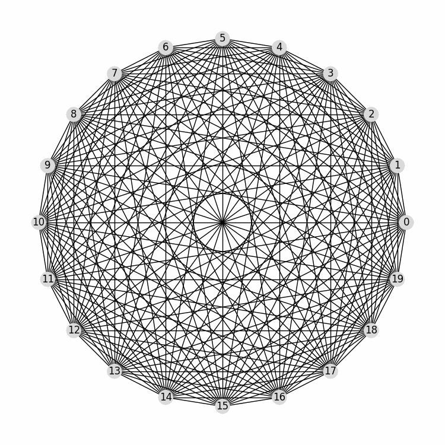

# Quantum Hamiltonian Dynamics Visualizer

Visualize Hamiltonian dynamics of quantum systems with a complex weighted graph representation.
<p align="center">
  
</p>


## Overview

This repository provides classes and functions to create and visualize Hamiltonian matrices for quantum systems. The `Hamiltonian` class generates a Hamiltonian matrix and computes transition probabilities, while the `State` class represents quantum states and simulates their evolution over time. The visualization is implemented using the `pyvis` library for interactive graph representations.

## Features

- **Random Hamiltonian Generation**: Generate random weak Hamiltonian matrices.
- **Graph Representation**: Visualize Hamiltonian matrices and quantum states as complex weighted graphs.
- **State Propagation**: Simulate the time evolution of quantum states.
- **Interactive Visualization**: Explore quantum systems through interactive graph visualizations.

## Installation

1. Clone the repository:
    ```sh
    git clone https://github.com/OtiDioti/HermitianGraphs.git
    cd HermitianGraphs
    ```

2. Install the required dependencies:
    ```sh
    pip install -r requirements.txt
    ```

## Usage

### Hamiltonian Class

#### Initialization
```python
from Modules.classes import Hamiltonian

# Initialize with a random Hamiltonian matrix
ham = Hamiltonian(dim=4, emin=0, emax=10)
```

#### Methods
- `get_random_weak_ham(dim, emin, emax, tol)`: Generates a random weak Hamiltonian matrix.
- `get_graph(col_map_nodes="RdBu_r", menu_toggle=False, color_font="white", bgcolor="#222222", vmin=0, vmax=1)`: Generates a graph representation of the Hamiltonian matrix.
- `get_probabilities(hbar=1, tol=1e-15)`: Calculates transition probabilities based on the Hamiltonian matrix.

### State Class

#### Initialization
```python
from Modules.classes import State

# Initialize with a state vector and a Hamiltonian
state_vector = np.array([1, 0, 0, 0])
state = State(state_vector, ham)
```

#### Methods
- `get_graph(H, networkx=False, col_map_nodes="RdBu_r", tol=1e-15)`: Generates a graph representation of the state vector.
- `move(U, col_map_nodes="RdBu_r", networkx=False)`: Updates the state vector by applying a unitary transformation.
- `propagate(H, dt=0.1, t_final=None, networkx=False, sim_tol=1e-15, col_map_nodes="RdBu_r")`: Propagates the state vector over time.

### Example
```python
# Initialize Hamiltonian and State
ham = Hamiltonian(dim=4, emin=0, emax=10)
state_vector = np.array([1, 0, 0, 0])
state = State(state_vector, ham)

# Visualize the initial state
state.graph.show("initial_state.html")

# Propagate the state and visualize the final state
states, similarities = state.propagate(ham, dt=0.1, t_final=1)
states[-1].graph.show("final_state.html")
```

## Dependencies

- `numpy`
- `matplotlib`
- `pyvis`
- `scipy`
- `tqdm`
- `networkx`

## Contributing

Contributions are welcome! Please feel free to submit a Pull Request.
